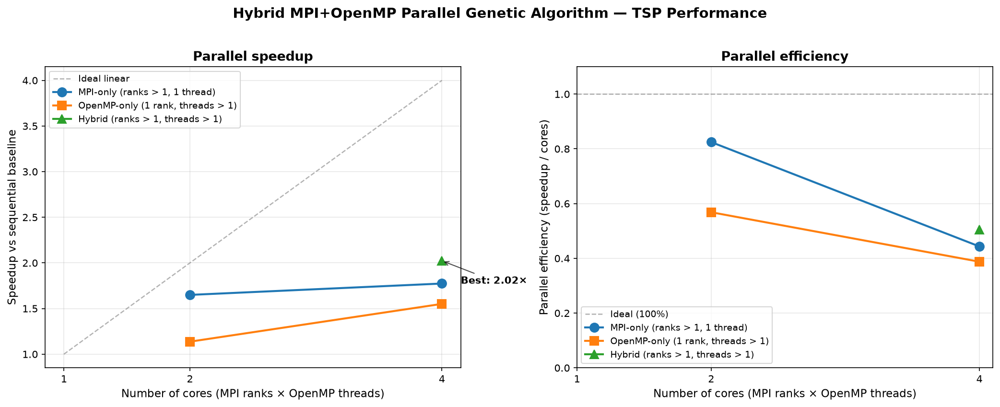
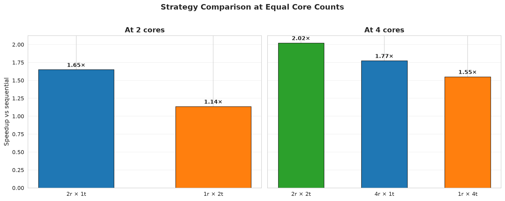
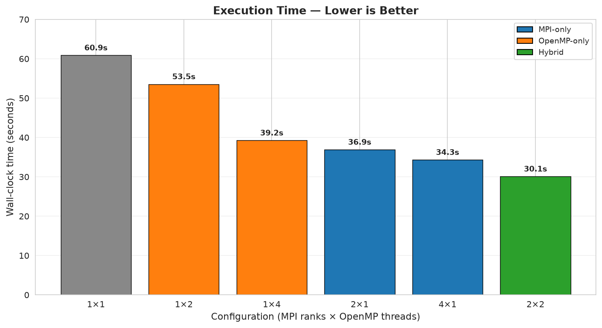
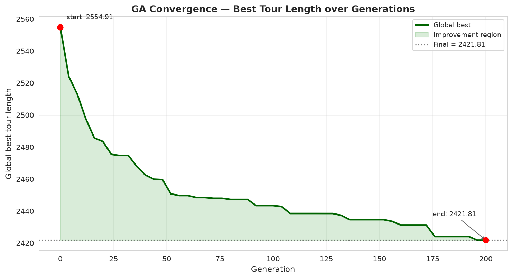
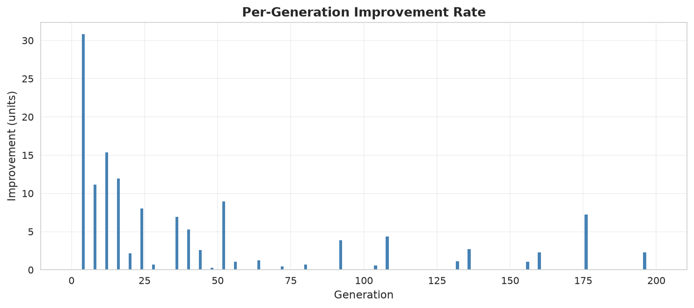
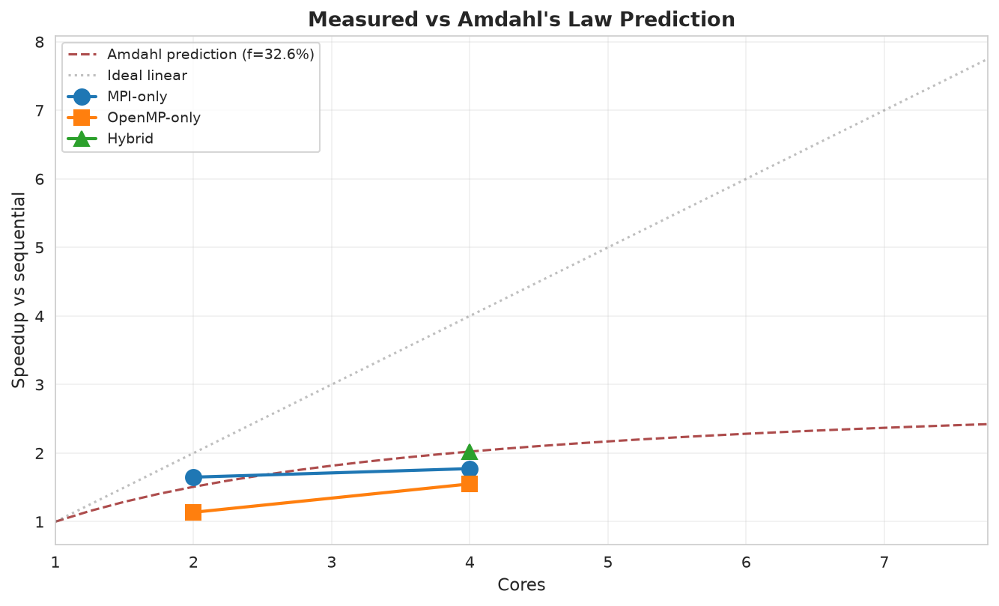

# CS3006 Hybrid MPI OpenMP Parallel Genetic Algorithm for Large Scale Combinatorial Optimization

An island-model **Genetic Algorithm** for the **Traveling Salesman Problem**, implemented in modern C++17 with **hybrid MPI + OpenMP** parallelism.

## Description

This project is a final-year undergraduate implementation of a parallel genetic algorithm for large-scale combinatorial optimization. The algorithm solves the Traveling Salesman Problem (TSP) on synthetic instances with up to 5,000 cities using a hybrid parallelization strategy:

- **MPI (coarse-grained)** distributes independent sub-populations ("islands") across processes with ring-topology migration of the fittest individuals.
- **OpenMP (fine-grained)** parallelizes the two most compute-intensive phases within each process: fitness evaluation of the population, and child creation during crossover and mutation.

The implementation is verified against a NumPy reference for its tour-length computation, tested with assertion-based unit tests for all GA operators, and packaged with a Docker image for reproducible builds and runs. A Jupyter notebook provides the full performance analysis, generating all figures used in the report.

## Results

**Peak speedup: 2.02x on 4 logical cores (50.6% parallel efficiency)**

Tested on N=5000 cities, population 1000, 200 generations.

| Cores | Configuration | Time (s) | Speedup | Efficiency |
|------:|:--------------|---------:|--------:|-----------:|
| 1     | 1 rank x 1 thread (baseline) | 60.87 | 1.00x | 100.0% |
| 2     | 2 ranks x 1 thread | 36.90 | 1.65x | 82.5% |
| 2     | 1 rank x 2 threads | 53.54 | 1.14x | 56.8% |
| 4     | 4 ranks x 1 thread | 34.31 | 1.77x | 44.3% |
| 4     | 1 rank x 4 threads | 39.25 | 1.55x | 38.8% |
| 4     | **2 ranks x 2 threads** | **30.09** | **2.02x** | **50.6%** |



The same data visualized as a two-panel comparison — speedup on the left, efficiency on the right — with each parallelization strategy color-coded:



Wall-clock execution time per configuration, sorted from slowest to fastest:



### Key findings

1. **MPI outperforms OpenMP at equal core counts**: each MPI rank holds a private copy of the distance matrix, spreading the working set across cache regions. OpenMP threads contend for the same shared matrix and saturate the memory bus.
2. **Hybrid wins overall**: combining 2 MPI ranks with 2 OpenMP threads per rank delivers the best of both worlds.
3. **Sub-linear scaling beyond 2 cores**: the WSL2 host's 4 logical cores are likely 2 physical + SMT, and the workload is memory-bandwidth-bound.
4. **Island-model migration improves solution quality**: the best 2-rank run found a tour approximately 1.5% shorter than the single-rank run, demonstrating that parallelization is not only about speed.
5. **Amdahl's Law consistency**: back-solving the observed peak speedup against Amdahl's Law yields a sequential fraction of approximately 32.6%, giving a theoretical speedup ceiling of 3.07x on infinite cores. The measured 2.02x on 4 cores reaches approximately 66% of that ceiling.

### Convergence behavior

The GA converges smoothly over generations, with the vast majority of the improvement concentrated in the first two-thirds of the run:



Per-generation improvement rate, showing the sharp early gains and the eventual plateau:



### Amdahl's Law analysis

Measured speedups versus the Amdahl prediction based on the back-solved sequential fraction:



## Architecture

```
+----------------------------------------------------------+
|                    MPI_COMM_WORLD                        |
+---------------+---------------+---------------+----------+
|   Island 0    |   Island 1    |   Island 2    |  Island  |
|  rank=0       |  rank=1       |  rank=2       |    P-1   |
|               |               |               |          |
|  Population   |  Population   |  Population   |  ...     |
|  - Ind 0      |  - Ind 0      |  - Ind 0      |          |
|  - Ind 1      |  - Ind 1      |  - Ind 1      |          |
|    ...        |    ...        |    ...        |          |
|  - Ind M-1    |  - Ind M-1    |  - Ind M-1    |          |
|               |               |               |          |
|  OpenMP       |  OpenMP       |  OpenMP       |  OpenMP  |
|  threads      |  threads      |  threads      |  threads |
|  -> fitness   |  -> fitness   |  -> fitness   |  -> fit  |
+-------+-------+-------+-------+-------+-------+-----+----+
        |               |               |             |
        +--- Ring-topology migration (every K gens) ---+
             Best migrants sent to next rank,
             received from previous rank via MPI_Sendrecv
```

**Per generation:**

1. `evolve_generation()`: selection, OX1 crossover, swap mutation, elitism (OpenMP-parallel child creation)
2. `evaluate_population()`: tour length computation (OpenMP-parallel)
3. Every `migration_interval` generations: ring migration via `MPI_Sendrecv`
4. At log boundaries: `MPI_Allreduce` + `MPI_Bcast` for global best

## Parallel decomposition

The algorithm combines two orthogonal layers of parallelism:

**Coarse-grained (MPI):** the global population of size `--pop` is divided evenly across `-np` MPI ranks. Each rank evolves its own sub-population independently. Every `migration_interval` generations (default 25), each rank sends its `num_migrants` best individuals to its successor and receives the same number from its predecessor via `MPI_Sendrecv`. Received migrants unconditionally replace the receiver's worst individuals. This preserves the total work per generation constant across configurations, which makes speedup measurements fair.

**Fine-grained (OpenMP):** within each rank, two OpenMP parallel regions per generation:
- The population-wide fitness evaluation loop uses `schedule(static)` since every individual's tour length costs exactly O(N) with zero branching.
- The child-creation loop in `evolve_generation()` uses `schedule(dynamic, 4)` and a per-thread `std::mt19937_64` RNG seeded deterministically from a single per-generation master draw.

The global best tour is reduced across ranks using `MPI_MINLOC` on a `(fitness, rank)` pair, followed by `MPI_Bcast` of the winning genome.

## Quick Start

### Requirements

- Ubuntu 24.04 (WSL2 supported)
- GCC 13+ with OpenMP
- OpenMPI 4.1+
- CMake 3.20+ and Ninja
- Python 3.12+ (for data generation and analysis)

### Build

```bash
git clone https://github.com/zahmed02/CS3006-Hybrid-MPI-OpenMP-Parallel-Genetic-Algorithm-for-Large-Scale-Combinatorial-Optimization.git
cd CS3006-Hybrid-MPI-OpenMP-Parallel-Genetic-Algorithm-for-Large-Scale-Combinatorial-Optimization
cmake -S . -B build -G Ninja -DCMAKE_BUILD_TYPE=Release
cmake --build build -j$(nproc)
```

### Generate a TSP instance

```bash
python3 -m venv ~/.venvs/pdc
source ~/.venvs/pdc/bin/activate
pip install numpy matplotlib pandas seaborn scipy

python scripts/generate_tsp.py --cities 5000 --seed 42 --out data/raw/tsp_5000.txt
```

### Run the hybrid GA

```bash
OMP_NUM_THREADS=2 mpirun -np 2 --oversubscribe ./build/bin/pdc_ga \
    --data data/raw/tsp_5000.txt \
    --generations 200 \
    --pop 1000
```

### Run the benchmark sweep

```bash
bash scripts/run_experiments.sh
~/.venvs/pdc/bin/python scripts/plot_results.py
```

### Run inside Docker

```bash
docker build -t pdc-ga -f docker/Dockerfile .
docker run --rm pdc-ga
```

The Docker image is self-contained: it generates a synthetic 2000-city instance at runtime, runs the hybrid GA for 100 generations, and prints a per-generation trace plus a final summary. No host filesystem mounting is required.

## Repository Structure

```
.
|-- src/                     C++ implementation
|   |-- main.cpp               Driver: CLI, GA loop, timing
|   |-- ga.cpp                 GA operators (init, select, OX1, mutate)
|   |-- fitness.cpp            TSP tour length, distance matrix
|   |-- mpi_manager.cpp        Ring migration, global best reduction
|   `-- utils.cpp              Timer, CSV output, logging
|-- include/                 Public headers
|-- tests/                   Unit tests + fitness cross-check harness
|-- scripts/                 Python / bash utilities
|   |-- generate_tsp.py        Synthetic TSP instance generator
|   |-- run_experiments.sh     6-config benchmark sweep
|   |-- plot_results.py        Speedup / efficiency plot
|   `-- verify_fitness.py      NumPy cross-check for tour_length()
|-- data/                    TSP instances (generated)
|-- results/                 Benchmarks, logs, plots
|-- docker/                  Reproducible build container
|-- docs/                    Analysis notebook and figures
`-- README.md
```

## Command-line options

```
Usage: pdc_ga [options]

Options:
  --data PATH           TSP coordinate file (default: data/raw/tsp_10000.txt)
  --out PATH            Per-generation CSV trace (default: results/benchmarks/trace.csv)
  --cities N            Cities to generate (default: 10000)
  --generations G       GA generations (default: 500)
  --pop P               Global population across all ranks (default: 1000)
  --seed S              RNG seed (default: 42)
  --generate            Generate synthetic coordinates instead of loading
  --quiet               Suppress progress output on rank 0
  --help, -h            Show this help and exit
```

## Verification

### Unit tests

Five assertion-based unit tests cover the core GA operators:

```bash
cd build
ctest --output-on-failure
```

Expected:

```
1/1 Test #1: basic ............................   Passed
```

Running the test binary directly prints the individual test outcomes:

```
[PASS] initialize_population
[PASS] order_crossover produces valid permutations
[PASS] swap_mutation preserves permutation
[PASS] tournament_select picks global best (tournament = pop size)
[PASS] tour_length matches analytic values
```

### Cross-check against NumPy

The C++ `tour_length()` implementation is cross-checked against an independent NumPy reference. Two instances of different sizes are used:

```bash
~/.venvs/pdc/bin/python scripts/verify_fitness.py --cities 20 --seed 42
./build/bin/fitness_check data/raw/tsp_verify_20.txt data/raw/tour_verify_20.txt

~/.venvs/pdc/bin/python scripts/verify_fitness.py --cities 100 --seed 7
./build/bin/fitness_check data/raw/tsp_verify_100.txt data/raw/tour_verify_100.txt
```

Both print the same value to 9 or more decimal places (last-digit differences arise from floating-point summation order, not from algorithmic disagreement).

## Analysis notebook

The full performance analysis is available as a Jupyter notebook:

```bash
cd docs
~/.venvs/pdc/bin/jupyter notebook analysis.ipynb
```

Alternatively, open it directly in VS Code with the Jupyter extension installed. The notebook:

1. Loads `results/benchmarks/speedup.csv` and `results/benchmarks/trace.csv`
2. Classifies each configuration into Baseline, MPI-only, OpenMP-only, or Hybrid
3. Produces eight figures: speedup, efficiency, wall-clock time, strategy comparison at equal core counts, convergence trace, per-generation improvement rate, Amdahl's Law back-solve, and final solution quality
4. Prints a formatted summary of key findings suitable for direct inclusion in the written report

All figures are saved to `docs/figures/` at 150 DPI.

## Design notes

**Why OX1 crossover and not PMX or CX?** Order Crossover preserves the relative order of cities inherited from the second parent, which matches the intuition that good TSP tours share relative orderings of nearby cities. OX1 is also simpler to verify than PMX.

**Why swap mutation and not inversion?** Swap mutation is the simplest permutation-preserving operator and introduces minimal disruption to already-good subsequences. Inversion and scramble mutation can be evaluated as alternatives in future work.

**Why per-thread RNGs in the parallel child-creation loop?** Child creation is O(P * N) per generation, comparable in cost to fitness evaluation. Parallelizing it required eliminating the data race on the shared RNG. Each OpenMP thread derives its own `mt19937_64` from a master seed drawn once per generation, giving independence without a critical section. The trade-off is that exact reproducibility holds only for fixed `OMP_NUM_THREADS`.

**Why sort the population every generation?** The sort is O(P log P), negligible compared to the O(P * N) fitness and child-creation work. It simplifies elitism, tournament selection, and best-individual tracking.

## Technologies

- **Language:** C++17
- **Parallelism:** OpenMP 4.5, OpenMPI 4.1
- **Build:** CMake 3.28, Ninja 1.11, ccache 4.9
- **Testing:** assertion-based unit tests, NumPy reference cross-check
- **Analysis:** Python 3.12, NumPy 2.5, Pandas 3.0, Matplotlib 3.11, Seaborn 0.13
- **Container:** Docker (Ubuntu 24.04 base)
- **Version control:** Git, GitHub

## References

1. Amdahl, G. M. (1967). "Validity of the single processor approach to achieving large-scale computing capabilities." *AFIPS Spring Joint Computer Conference*.
2. Cantú-Paz, E. (2000). *Efficient and Accurate Parallel Genetic Algorithms*. Kluwer Academic Publishers.
3. Beardwood, J., Halton, J. H., and Hammersley, J. M. (1959). "The shortest path through many points." *Mathematical Proceedings of the Cambridge Philosophical Society*, 55(4), 299–327.
4. Davis, L. (1985). "Applying adaptive algorithms to epistatic domains." *Proceedings of the International Joint Conference on Artificial Intelligence*.
5. Message Passing Interface Forum. *MPI: A Message-Passing Interface Standard, Version 4.0*. 2021.
6. OpenMP Architecture Review Board. *OpenMP Application Programming Interface, Version 5.2*. 2021.

## License

MIT. See [LICENSE](LICENSE) for details.
