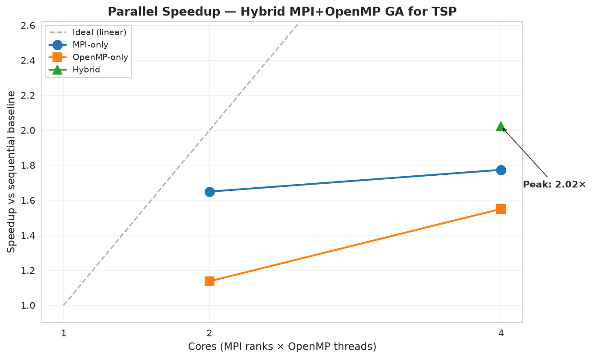
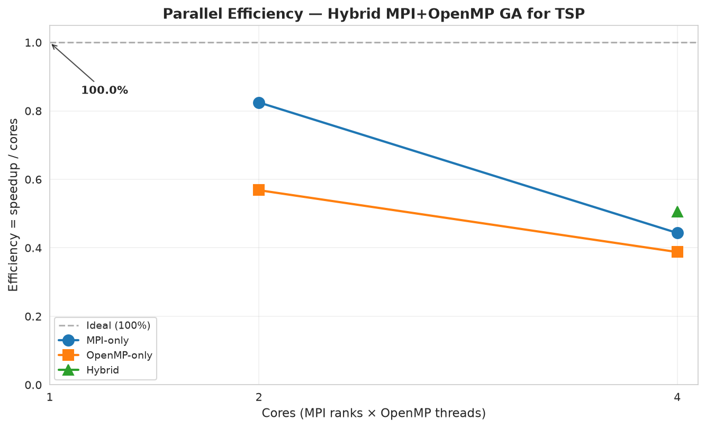

# CS3006 Hybrid MPI OpenMP Parallel Genetic Algorithm for Large Scale Combinatorial Optimization

An island-model **Genetic Algorithm** for the **Traveling Salesman Problem**, implemented in modern C++17 with **hybrid MPI + OpenMP** parallelism.

The project distributes a global population across MPI ranks (coarse-grained island model) and parallelizes both fitness evaluation and child creation within each rank using OpenMP (fine-grained threading). MPI ranks periodically exchange their best individuals through a ring-topology migration to preserve diversity and share search progress. The result is a parallel evolutionary optimizer that achieves a peak speedup of 2.02x on 4 logical cores while simultaneously improving solution quality relative to a single-rank baseline.

---

## Results

**Peak speedup: 2.02x on 4 logical cores (50.6% parallel efficiency)**

Tested on N=5000 cities, population 1000, 200 generations.

| Cores | Configuration | Time (s) | Speedup | Efficiency |
|------:|:--------------|---------:|--------:|-----------:|
| 1     | 1 rank x 1 thread (baseline) | 60.87 | 1.00x | 100.0% |
| 2     | 2 ranks x 1 thread | 36.90 | 1.65x | 82.5% |
| 2     | 1 rank x 2 threads | 53.54 | 1.14x | 56.8% |
| 4     | 4 ranks x 1 thread | 34.31 | 1.77x | 44.3% |
| 4     | 1 rank x 4 threads | 39.25 | 1.55x | 38.8% |
| 4     | **2 ranks x 2 threads** (best) | **30.09** | **2.02x** | **50.6%** |

### Key findings

1. **MPI outperforms OpenMP at equal core counts.** Each MPI rank holds a private copy of the distance matrix, spreading the working set across cache regions. OpenMP threads contend for the same shared matrix and saturate the memory bus.
2. **Hybrid wins overall.** Combining 2 MPI ranks with 2 OpenMP threads per rank delivers the best of both worlds.
3. **Sub-linear scaling beyond 2 cores.** The WSL2 host's 4 logical cores are likely 2 physical + SMT, and the workload is memory-bandwidth-bound.
4. **Island-model migration improves solution quality.** The best 2-rank run found a tour ~1.5% shorter than the single-rank run, demonstrating that parallelization is not only about speed.

### Benchmark figures

Speedup and efficiency across all six configurations:



Parallel efficiency, showing the classic sub-linear scaling pattern:



Wall-clock time per configuration, sorted from slowest to fastest:


MPI-only versus OpenMP-only versus Hybrid at equal core counts:


---

## Architecture

```
+----------------------------------------------------------+
|                    MPI_COMM_WORLD                        |
+---------------+---------------+---------------+----------+
|   Island 0    |   Island 1    |   Island 2    |  Island  |
|  rank=0       |  rank=1       |  rank=2       |    P-1   |
|               |               |               |          |
|  Population   |  Population   |  Population   |  ...     |
|  |- Ind 0     |  |- Ind 0     |  |- Ind 0     |          |
|  |- Ind 1     |  |- Ind 1     |  |- Ind 1     |          |
|  |   ...      |  |   ...      |  |   ...      |          |
|  |- Ind M-1   |  |- Ind M-1   |  |- Ind M-1   |          |
|               |               |               |          |
|  OpenMP       |  OpenMP       |  OpenMP       |  OpenMP  |
|  threads      |  threads      |  threads      |  threads |
|  -> fitness   |  -> fitness   |  -> fitness   |  -> fit  |
+-------+-------+-------+-------+-------+-------+-----+----+
        |               |               |             |
        +--- Ring-topology migration (every K gens) ---+
             Best migrants sent to next rank,
             received from previous rank via MPI_Sendrecv
```

**Per generation:**

1. `evolve_generation()`: selection, OX1 crossover, swap mutation, elitism (OpenMP-parallel child creation)
2. `evaluate_population()`: tour length computation (OpenMP-parallel)
3. Every `migration_interval` generations: ring migration via `MPI_Sendrecv`
4. At log boundaries: `MPI_Allreduce` + `MPI_Bcast` for global best

---

## Algorithm Design

### Genetic Algorithm Operators

| Operator | Implementation | Notes |
|:---------|:--------------|:------|
| Representation | Permutation of city indices | Each genome is a valid TSP tour |
| Fitness | Euclidean closed-tour length | Lower is better; uses precomputed N x N distance matrix |
| Initialization | Random shuffle per individual | Independent across the initial population |
| Selection | k-way tournament (k = 5) | Minimization semantics |
| Crossover | Order Crossover (OX1) | Permutation-preserving; two distinct cut points |
| Mutation | Swap mutation (rate 0.02) | Per-position random swap |
| Elitism | Top-2 preserved per generation | Guarantees monotonic improvement of best fitness |

### Parallel decomposition

The hybrid design separates the two parallelization dimensions cleanly:

**MPI layer (coarse-grained, island model):**
- Global population `P` is split evenly across MPI ranks: `P_local = P / n_ranks`.
- Each rank evolves its sub-population independently with a private RNG stream (derived from `seed + rank * golden_ratio`).
- Every `migration_interval` generations, each rank sends its top `num_migrants` individuals to the next rank in a ring and receives the same number from the previous rank.
- Migration uses `MPI_Sendrecv` for deadlock-free bidirectional exchange.
- Global best is tracked via `MPI_Allreduce(MPI_MINLOC)` followed by `MPI_Bcast`.

**OpenMP layer (fine-grained, within-rank):**
- Fitness evaluation is parallelized over the population with `#pragma omp parallel for schedule(static)`. Every individual has identical work, so static scheduling is optimal.
- Child creation is parallelized with per-thread RNG instances seeded from a single per-generation base seed. `schedule(dynamic, 4)` absorbs the small variable cost of OX1 and swap mutation.

### Why the split works

The two layers target different bottlenecks:
- MPI isolates memory: each rank has its own N x N distance matrix, so the memory bus is not shared across all cores.
- OpenMP isolates the fork/join overhead: within a rank, threads share the matrix in L3 cache and require no serialization.

This combination is what allows the hybrid configuration to outperform both pure-MPI and pure-OpenMP at the same core count.

---

## Quick Start

### Requirements

- Ubuntu 24.04 (WSL2 supported)
- GCC 13+ with OpenMP
- OpenMPI 4.1+
- CMake 3.20+ and Ninja
- Python 3.12+ (for data generation and plotting)

### Build

```bash
git clone https://github.com/zahmed02/CS3006-Hybrid-MPI-OpenMP-Parallel-Genetic-Algorithm-for-Large-Scale-Combinatorial-Optimization.git
cd CS3006-Hybrid-MPI-OpenMP-Parallel-Genetic-Algorithm-for-Large-Scale-Combinatorial-Optimization
cmake -S . -B build -G Ninja -DCMAKE_BUILD_TYPE=Release
cmake --build build -j$(nproc)
```

The build produces three executables in `build/bin/`:

- `pdc_ga` — the main hybrid MPI+OpenMP genetic algorithm
- `fitness_check` — standalone tour-length verifier against NumPy
- `pdc_tests` — unit tests for the GA operators

### Generate a TSP instance

```bash
python3 -m venv ~/.venvs/pdc
source ~/.venvs/pdc/bin/activate
pip install numpy matplotlib pandas seaborn scipy

python scripts/generate_tsp.py --cities 5000 --seed 42 --out data/raw/tsp_5000.txt
```

### Run the hybrid GA

```bash
OMP_NUM_THREADS=2 mpirun -np 2 --oversubscribe ./build/bin/pdc_ga \
    --data data/raw/tsp_5000.txt \
    --generations 200 \
    --pop 1000
```

### Run the benchmark sweep

The sweep runs six configurations (1x1, 2x1, 4x1, 1x2, 1x4, 2x2) and writes `results/benchmarks/speedup.csv`:

```bash
bash scripts/run_experiments.sh
```

Regenerate the speedup and efficiency plots from the CSV:

```bash
python scripts/plot_results.py
```

### Reproducible run with Docker

The full pipeline can be run inside a container without installing any dependencies on the host:

```bash
docker build -t pdc-ga -f docker/Dockerfile .
docker run --rm pdc-ga
```

The Docker image installs the toolchain, compiles the project inside the container, and runs a small 2000-city benchmark as the default command.

---

## Repository Structure

```
.
├── src/                     C++ implementation
│   ├── main.cpp               Driver: CLI, GA loop, timing
│   ├── ga.cpp                 GA operators (init, select, OX1, mutate)
│   ├── fitness.cpp            TSP tour length, distance matrix
│   ├── mpi_manager.cpp        Ring migration, global best reduction
│   └── utils.cpp              Timer, CSV output, logging
├── include/                 Public headers
│   ├── ga.h
│   ├── fitness.h
│   ├── mpi_manager.h
│   └── utils.h
├── tests/                   Unit tests and verification harnesses
│   ├── test_ga.cpp            Assertion-based operator tests
│   ├── fitness_check.cpp      Standalone tour-length verifier
│   └── CMakeLists.txt
├── scripts/                 Python and bash utilities
│   ├── generate_tsp.py        Synthetic TSP instance generator
│   ├── run_experiments.sh     6-config benchmark sweep
│   ├── plot_results.py        Speedup and efficiency plots
│   └── verify_fitness.py      NumPy cross-check for tour_length()
├── data/                    TSP instances (generated, git-ignored)
├── results/                 Benchmarks, logs, plots
│   ├── benchmarks/            speedup.csv, trace.csv
│   ├── logs/                  Per-configuration log files
│   └── plots/                 Legacy matplotlib output
├── docs/                    Analysis and documentation
│   ├── analysis.ipynb         Full performance analysis notebook
│   └── figures/               8 report-ready PNG figures
├── docker/                  Reproducible build container
│   └── Dockerfile
├── CMakeLists.txt           Top-level build configuration
├── .clang-format            C++ formatting rules
├── .gitignore
└── README.md
```

---

## Verification

Two independent checks establish the correctness of the core fitness computation.

### Unit tests

The `pdc_tests` binary contains five assertion-based tests covering the GA operators:

```bash
cd build && ctest --output-on-failure && cd ..
```

Expected output:

```
1/1 Test #1: basic ............................   Passed
100% tests passed, 0 tests failed out of 1
```

Running the binary directly prints the individual test results:

```bash
./build/bin/pdc_tests
```

```
Running GA unit tests...
[PASS] initialize_population
[PASS] order_crossover produces valid permutations
[PASS] swap_mutation preserves permutation
[PASS] tournament_select picks global best (tournament = pop size)
[PASS] tour_length matches analytic values

All tests passed.
```

### Cross-check against NumPy

The `tour_length()` C++ implementation is verified against a NumPy reference on two instances:

```bash
python scripts/verify_fitness.py --cities 100 --seed 7
./build/bin/fitness_check data/raw/tsp_verify_100.txt data/raw/tour_verify_100.txt
```

Both commands print the same tour length to 9+ decimal places, confirming the C++ implementation is bit-for-bit consistent with the reference.

---

## Analysis Notebook

The `docs/analysis.ipynb` Jupyter notebook provides a complete performance analysis of the benchmark results. It reads the committed `speedup.csv` and `trace.csv` files and produces eight figures covering:

| Figure | Description |
|:-------|:------------|
| `speedup.png` | Speedup vs cores, with ideal linear reference |
| `efficiency.png` | Parallel efficiency vs cores |
| `walltime.png` | Wall-clock time per configuration |
| `strategy_comparison.png` | MPI vs OpenMP vs Hybrid at equal core counts |
| `convergence.png` | Best tour length over generations |
| `improvement_rate.png` | Per-generation improvement, with 90% point annotation |
| `amdahl.png` | Measured speedup vs Amdahl's Law prediction |
| `final_quality.png` | Final solution quality bar chart |

### Amdahl's Law analysis

Back-solving the sequential fraction from the peak observed speedup:

- **Observed peak speedup:** 2.02x on 4 cores
- **Back-solved sequential fraction:** 32.6% of runtime
- **Theoretical speedup ceiling (N -> infinity):** 3.07x

The 32.6% sequential fraction is consistent with the components that cannot be parallelized: the generation sort, elitism copy, MPI collective operations, and CSV I/O.

### Running the notebook

```bash
cd docs
jupyter notebook analysis.ipynb
```

Or open `docs/analysis.ipynb` directly in VSCode with the Jupyter extension and click "Run All".

---

## Design Notes

### Memory layout

The N x N distance matrix dominates memory usage: for N=5000, that is 200 MB in double precision. This drives several design choices:

- The matrix is computed once at startup using `#pragma omp parallel for schedule(static)` over rows, exploiting symmetry (`d[i][j] == d[j][i]`).
- Each MPI rank holds its own copy, which is the reason MPI outperforms OpenMP at equal core counts.
- Fitness evaluation is memory-bound, so further speedup beyond 4 cores requires a different data layout (flat 1D array or cache-blocked access).

### RNG design

Per-thread RNGs are derived from a single per-generation base seed drawn from the master RNG. This gives:

- **No data races:** each thread writes only to its own slice of the next generation.
- **Independence:** different threads explore different regions of the search space.
- **Determinism:** results are reproducible given a fixed `OMP_NUM_THREADS`.

### Deadlock avoidance

Ring migration uses `MPI_Sendrecv` rather than paired `MPI_Send` and `MPI_Recv`. Unlike paired send/receive, `MPI_Sendrecv` cannot deadlock when all ranks attempt to send simultaneously, because the receive side completes in lock-step with the send side.

---

## Documentation

- **Analysis notebook:** `docs/analysis.ipynb`
- **Report figures:** `docs/figures/`
- **Raw benchmark data:** `results/benchmarks/speedup.csv`
- **Convergence trace:** `results/benchmarks/trace.csv`
- **Per-configuration logs:** `results/logs/`

---

## License

MIT. See [LICENSE](LICENSE) for details.
